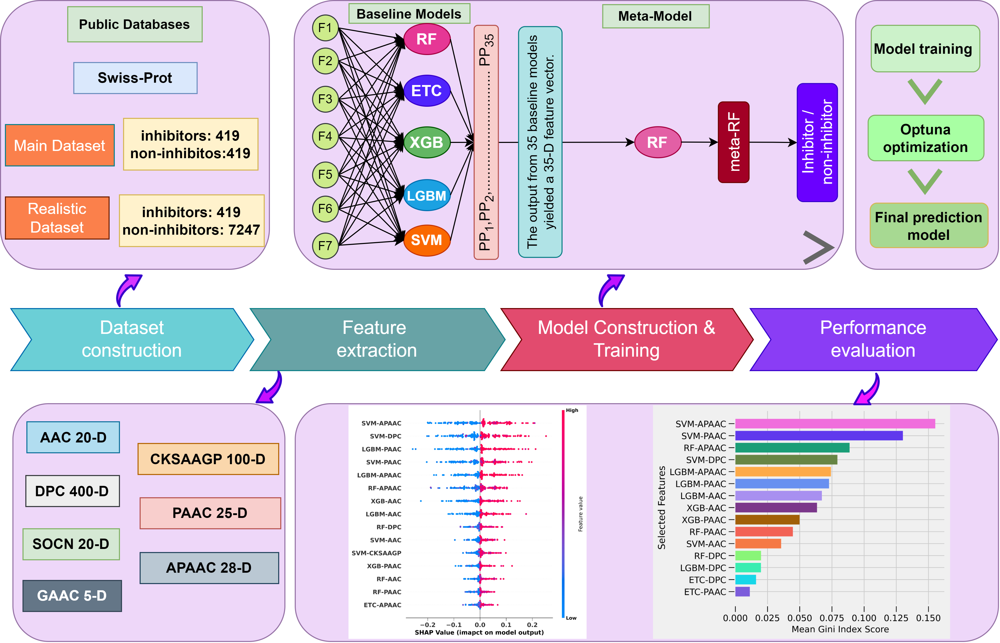

# POSSUM
### Identification and interpretation of potassium ion inhibitors using probabilistic feature vectors

The flow of potassium ions through cell membranes plays a crucial role in facilitating various cell processes such as hormone secretion, epithelial function, maintenance of electrochemical gradients, and electrical impulse formation. Potassium ion inhibitors are considered promising alternatives in treating cancer, muscle weakness, renal dysfunction, endocrine disorders, impaired cellular function, and cardiac arrhythmia. Thus, it becomes essential to identify and understand potassium ion inhibitors in order to regulate the ion flow across ion channels. In this study, we created a meta-model, POSSUM, for the identification of potassium ion inhibitors. Two distinct datasets were used for training, testing, and evaluation of the meta-model. We employed seven feature descriptors and five distinctive classifiers to construct 35 baseline models. We used the mean Gini index score to select the optimal base models and classifiers. The POSSUM method was trained on the optimal probabilistic feature vectors. The proposed optimal model, POSSUM, outperforms the baseline models and the existing methods on both datasets. We anticipate POSSUM will be a very useful tool and will be essential in the process of finding and screening possible potassium ion inhibitors.

 
 

# Requirments
### 1. scikit-learn:   1.2.1
### 2. xgboost:   2.0.3
### 3. lightgbm:   4.3.0
### 4. optuna:   3.6.0

 
 

# Architecture

